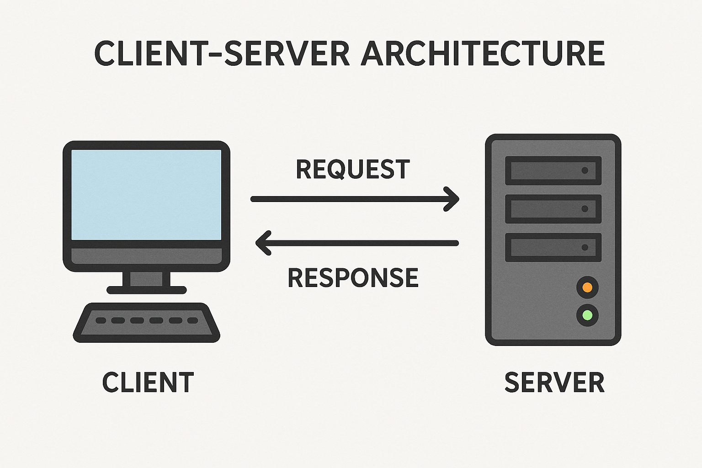

# Client-Server Architecture

**Client-Server Architecture** is a **computing model** where tasks or workloads are divided between two main entities:

- **Client**: the requester of services (like your browser or mobile app)
- **Server**: the provider of services (like a web server or database)

---

### 🔧 **How it Works**

1. **Client Sends a Request**:
    - The client (e.g., browser) initiates communication by sending a request to the server.
    - This could be a request for a web page, data, or to perform some action.
2. **Server Processes the Request**:
    - The server receives the request, processes it (e.g., queries a database, performs logic), and prepares a response.
3. **Server Sends Back a Response**:
    - The server sends the processed data or confirmation back to the client.
4. **Client Receives & Uses the Response**:
    - The client then presents the data to the user (e.g., rendering a web page or showing a notification).

---

### ✅ **Key Features**

- **Separation of concerns** (UI on client, logic/data on server)
- **Scalability** (servers can serve multiple clients)
- **Security** (sensitive data stays on the server)
- **Reliability** (servers can be monitored and maintained independently)

This sounds simple, but there’s a big question: ***How is the client even aware of the server's location?***
